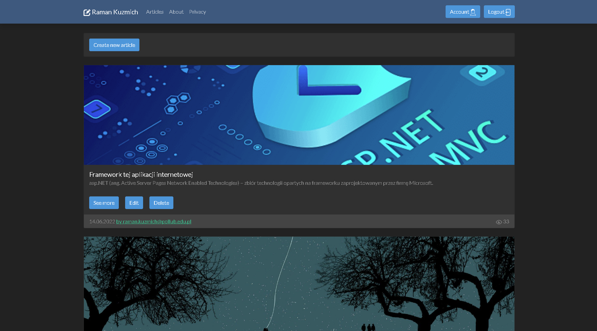
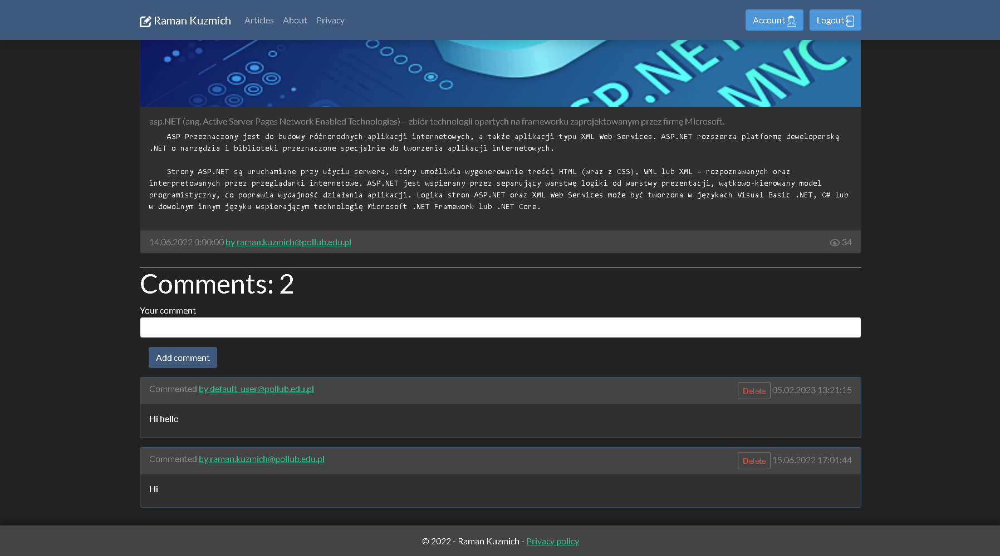
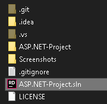
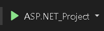
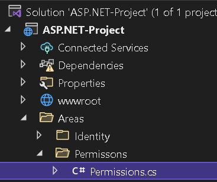
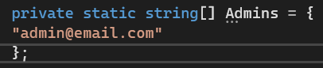

# Blog Website
An old university project. This is a personal blog site, created using ASP.NET and MS SQL as a database, the project is built on the principle of MVC. 
This site is an example of a simple blog, with all the functionality you need and the ability to leave an opinion on an article, create and delete articles and authorization.

## Features
- Registration
- Authentication
- Creating and deleting articles
- Creating and deleting comments
- Accounting for article traffic
- Adaptability for mobile devices
- Connection to an MS SQL database

## To do
- Create a new permissions system
- Dividing the functionality of controllers into modules
- Separating parts of the views into external methods

# How to use it
## Running the application
1. Open a solution in the IDE

3. Click "ASP.NET_project" run button

5. Click button to do DB migrations

## How to give permissons to a user
> The permissions system is temporary and will be changed soon

1. Open Permissions.cs

2. Add created user to an admin list

